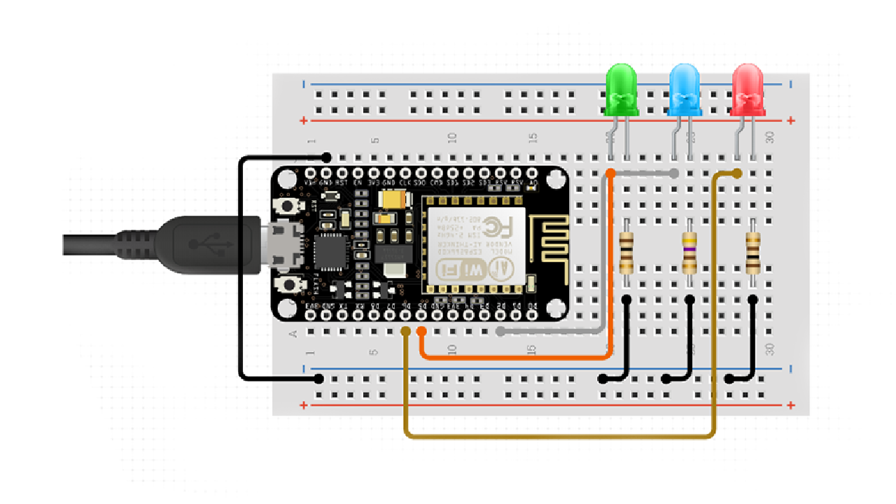
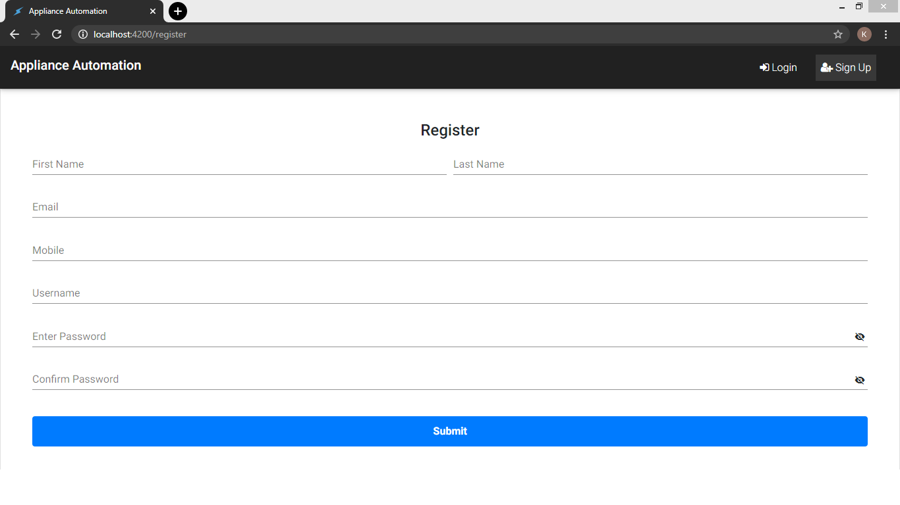

# IoT-Application-using-MEAN-Stack
IoT application built using the MEAN stack for controlling appliances connected to Node MCU.

## This repo contains the code for a Socket-MQTT Appliance Management App built using the following:
* MongoDB
* ExpressJS
* Angular
* NodeJS
* Arduino

## Schematic flow diagram demonstrating the working of the application:
 

## Circuit Diagram:
 

## Appliances Page:
Here you can control the LED's connected to the Node MCU.

 

## Sign In Page:
 

## Registration Page:
 

## Setup

1. Install this repository on your machine by downloading the zip file or running this command:

```
git clone https://github.com/KaranJagtiani/IoT-Application-using-MEAN-Stack.git
```

2. Run this command in "node-app" directory, as well as in the "angular-src" directory for installing the necessary node modules:

```
npm install
```

3. Add your broker service credentials in "app.js" and "nodemcu_sketch" files.

4. Make sure you have an active internet connection, and add your WiFi credentials in "nodemcu_sketch" file.

5. Upload "nodemcu_sketch" on your Node MCU.

6. Make sure MongoDB is running:

```
mongod
```

## Usage

1. Run the Node server using this command:

```
node app.js
```

2. To use the application, type this in your browser's URL field

```
http://localhost:3000/
```

## Enjoy!!
